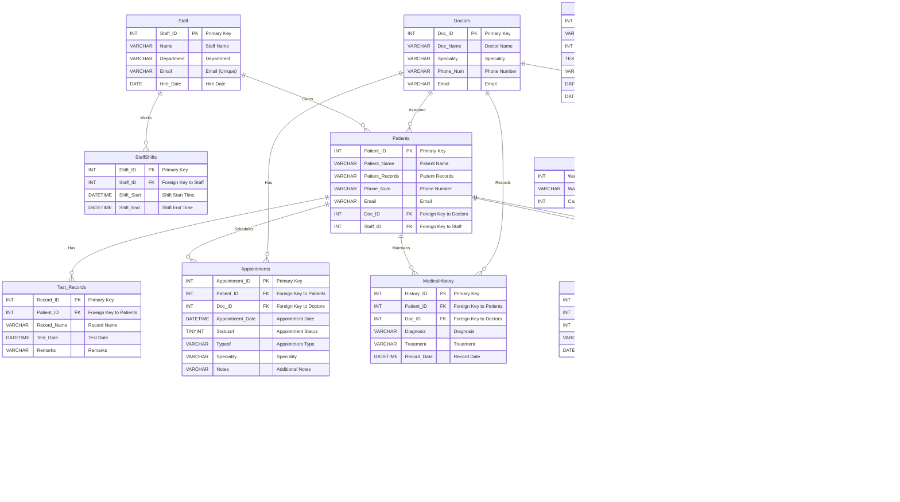

# Hospital-management-system

 This project was created in a group with the following people: [@onlyxool](https://github.com/onlyxool), [@AbinayaKalaiarasan](https://github.com/AbinayaKalaiarasan) and [@dornalaspandana](https://github.com/dornalaspandana). 

## Getting Started

### Installation

**Clone the repository**

```bash
git clone https://github.com/lugustavoalves/Hospital-management-system.git

cd Hospital-management-system
```


### Installation of dependent libraries

```bash
pip install -r requirements.txt
```


### Create Database

Run https://github.com/lugustavoalves/Hospital-management-system/blob/main/Hospital_Management_System.sql


Use [Conda](https://docs.anaconda.com/miniconda/) or [virtual environment](https://packaging.python.org/en/latest/guides/installing-using-pip-and-virtual-environments/) create a virtual environment


### Run the project (console)

```bash
python main_cli.py
```


Login with User Name: `admin` Password `admin`. OR login as patient without password


### Run the project (Web)

```bash
uvicorn main:app --reload
# or
python main_web.py
```


### Test

Use your browser to visit http://127.0.0.1:8000/doctors/


### ER Diagram




